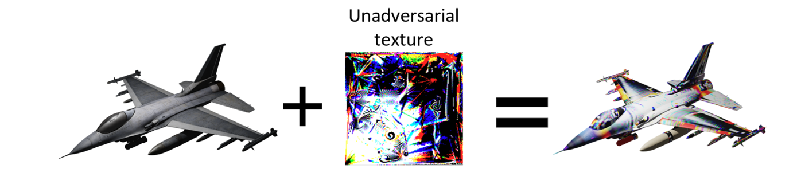
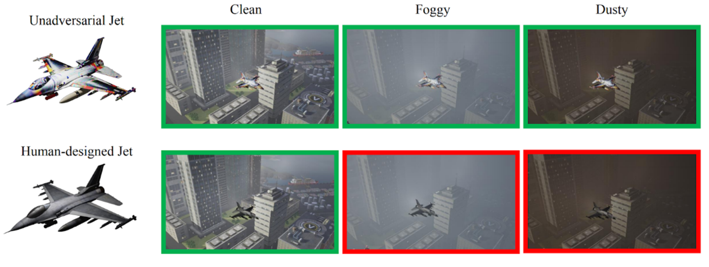

# Unadversarial Examples: Designing Objects for Robust Vision

This repository contains the code necessary to replicate the major results of our paper:

**Unadversarial Examples: Designing Objects for Robust Vision** <br>
*Hadi Salman\*, Andrew Ilyas\*, Logan Engstrom\*, Sai Vemprala, Aleksander Madry, Ashish Kapoor* <br>
[**Paper**](https://arxiv.org/abs/2012.12235) <br>
[**Blogpost (MSR)**](https://www.microsoft.com/en-us/research/blog/unadversarial-examples-designing-objects-for-robust-vision/) <br> 
[**Blogpost (Gradient Science)**](https://gradientscience.org/unadversarial) <br>

```bibtex
@article{salman2020unadversarial,
  title={Unadversarial Examples: Designing Objects for Robust Vision},
  author={Hadi Salman and Andrew Ilyas and Logan Engstrom and Sai Vemprala and Aleksander Madry and Ashish Kapoor},
  journal={arXiv preprint arXiv:2012.12235},
  year={2020}
}
```

## Getting started
The following steps will get you set up with the required packages (additional packages are required for the 3D textures setting, described below):

1.  Clone our repo: `git clone https://github.com/microsoft/unadversarial.git`

2.  Install dependencies:
    ```
    conda create -n unadv python=3.7
    conda activate unadv
    pip install -r requirements.txt
    ```


## Generating unadversarial examples for CIFAR10
*Here we show a quick example how to generate unadversarial examples for CIFAR-10. Similar procedure can be used with ImageNet. The entry point of our code is [main.py](src/main.py) (see the file for a full description of arguments).*

1- Download a pretrained CIFAR10 models, e.g., 
  ```
  mkdir pretrained-models & 
  wget -O pretrained-models/cifar_resnet50.ckpt "https://www.dropbox.com/s/yhpp4yws7sgi6lj/cifar_nat.pt?raw=1"
  ```
2- Run the following script
  ```
  python -m src.main \
        --out-dir OUT_DIR \
        --exp-name demo \
        --dataset cifar \
        --data /tmp \
        --arch resnet50 \
        --model-path pretrained-models/cifar_resnet50.ckpt \
        --patch-size 10 \
        --patch-lr 0.001 \
        --training-mode booster \
        --epochs 30 \
        --adv-train 0
  ```
You can see the trained patches images in `outdir/demo/save/` as training evolves.

3- Now you can evaluate the pretrained model on a boosted CIFAR10-C dataset (trained patch overlaid on CIFAR-10, then corruptions are added). Simply run
  ```
  python -m src.evaluate_corruptions \
        --out-dir OUT_DIR \
        --exp-name demo \
        --model-path OUT_DIR/demo/checkpoint.pt.best \
        --args-from-store data,dataset,arch,patch_size
  ```    
This will evaluate the pretrained model on various corruptions and display the results in the terminal.

4- That's it! 

## Generating 3D unadversarial textures
The following steps were tested on these configurations:
- Ubuntu 16.04, 8 x NVIDIA 1080Ti/2080Ti, 2x10-core Intel CPUs (w/ HyperThreading, 40 virtual cores), CUDA 10.2
- Ubuntu 18.04, 2 x NVIDIA K80, 1x12-core Intel CPU, CUDA 10.2

1- Choose a dataset to use as background images; we used ImageNet in our paper, for which you will need to have ImageNet in PyTorch ``ImageFolder`` format somewhere on your machine. If you don't have that, you can just use solid colors as the backgrounds (though the results might not match the paper).

2- Install the requirements: you will need a machine with CUDA 10.2 installed (this process might work with other versions of CUDA but we only tested 10.2), as well as ``docker``, ``nvidia-docker``, and the requirements mentioned earlier in the README.

3- Go to the ``docker/`` folder and run ``docker build --tag TAG .``, changing ``TAG`` to your preferred name for your docker instance. This will build a docker instance with all the requirements installed!

4- Open ``launch.py`` and edit the ``IMAGENET_TRAIN`` and ``IMAGENET_VAL`` variables to point to the ImageNet dataset, if it's installed and you want to use it. Either way, change ``TAG`` on the last line of the file with whatever you named your docker instance in the last step.

5- Alter the parameters in ``src/configs/config.json`` according to your setup; the only things we would recommend altering are ``num_texcoord_renderers`` (this should not exceed the number of CPU cores you have available), ``exp_name`` (the name of the output folder, which will be created inside ``OUT_DIR`` from the previous step), and ``dataset`` (if you are using ImageNet, you can leave this be, otherwise change it to ``solids`` to use solid colors as the backgrounds).

6- From inside the docker folder, run ``python launch.py [--with-imagenet] --out-dir OUT_DIR --gpus GPUS `` from the same folder. The ``--with-imagenet`` argument should only be provided if you followed step four. The ``OUT_DIR`` argument should point to where you want the resulting models/output saved, and the ``GPUS`` argument should be a comma-separated list of GPU IDs that you would like to run the job on.

7- This process should open a new terminal (inside your docker instance). In this terminal, run ``GPU_MODE=0 bash run_imagenet.sh [bus|warplane|ship|truck|car] /src/configs/config.json /out``

8- Your 3D unadversarial texture should now be generating! Output, including example renderings, the texture itself, and the model checkpoint will be saved to ``$(OUT_DIR)/$(exp_name)``.  

An example texture that you would get for the `warplane` is
<p>

</p>

## Simulating 3D Unadversarial Objects in AirSim
Coming soon!

Environments, 3D models, along with python API for controlling these objects and running online object recognition inside [Microsoft's AirSim](https://github.com/microsoft/AirSim) high-fidelity simulator.

<p>

</p>


# Maintainers

* [Hadi Salman](https://twitter.com/hadisalmanX)
* [Andrew Ilyas](https://twitter.com/andrew_ilyas)
* [Logan Engstrom](https://twitter.com/logan_engstrom) 
* [Sai Vemprala](https://twitter.com/saihv) 
* [Aleksander Madry](https://twitter.com/aleks_madry) 
* [Ashish Kapoor](https://twitter.com/akapoor_av8r) 

## Contributing
This project welcomes contributions and suggestions.  Most contributions require you to agree to a
Contributor License Agreement (CLA) declaring that you have the right to, and actually do, grant us
the rights to use your contribution. For details, visit https://cla.opensource.microsoft.com.

When you submit a pull request, a CLA bot will automatically determine whether you need to provide
a CLA and decorate the PR appropriately (e.g., status check, comment). Simply follow the instructions
provided by the bot. You will only need to do this once across all repos using our CLA.

This project has adopted the [Microsoft Open Source Code of Conduct](https://opensource.microsoft.com/codeofconduct/).
For more information see the [Code of Conduct FAQ](https://opensource.microsoft.com/codeofconduct/faq/) or
contact [opencode@microsoft.com](mailto:opencode@microsoft.com) with any additional questions or comments.

## Trademarks

This project may contain trademarks or logos for projects, products, or services. Authorized use of Microsoft 
trademarks or logos is subject to and must follow 
[Microsoft's Trademark & Brand Guidelines](https://www.microsoft.com/en-us/legal/intellectualproperty/trademarks/usage/general).
Use of Microsoft trademarks or logos in modified versions of this project must not cause confusion or imply Microsoft sponsorship.
Any use of third-party trademarks or logos are subject to those third-party's policies.
